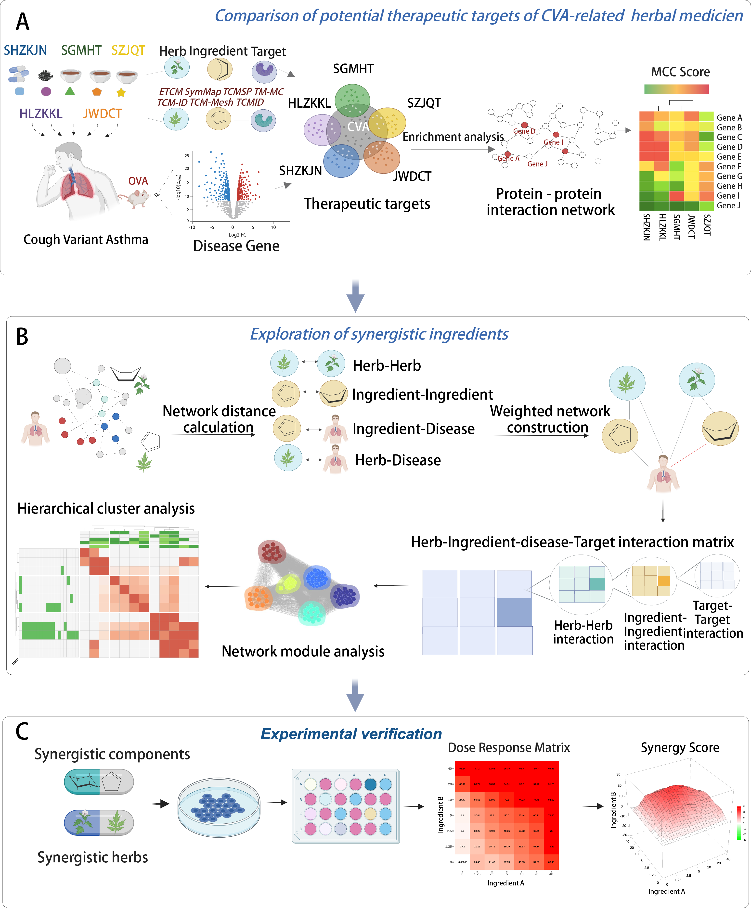

# syn_net_CVA is a novel network-based framework for synergistic ingredients discovery from herb medicines

  
   
  <em>Overview of our network models. (A) Systematic comparison of five prescriptions for CVA on their therapeutic targets. (B) Identify synergistic ingredients of CVA prescriptions through a comprehensive combination landscape (C) Experimental validation of synergistic ingredients.</em>

 Herbal medicine presents a promising alternative, offering enhanced synergistic efficacy and reduced side effects through combined herbal formulations. 
 
 However, the synergistic mechanisms of action (MOAs) of these herbal medicines remain largely unexplored. 
 
 Given the complexity of herbal systems, it is impractical to evaluate all possible drug/ingredient pairs experimentally.
 
To develop an innovative network model to consider synergistic ingredients or herbs in herbal medicine and identify their MOAs in the treatment of CVA, we developed an innovative network model to prioritize synergistic ingredients or herbs using advanced network proximity and community analysis. 

Our framework constructs a combinational atlas for each herbal medicine, quantifying interactions among herb-disease, ingredient-disease, herb-herb, and ingredient-ingredient relationships, thereby identifying synergistic components and their MOAs. 

Our network model offers novel insights into combinational strategies for treating CVA and has successfully identified effective herbal drug combinations from herbal medicines, specifically berberine and luteolin.

